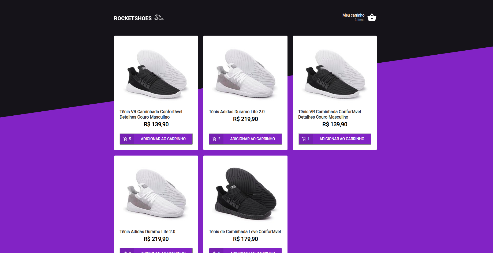
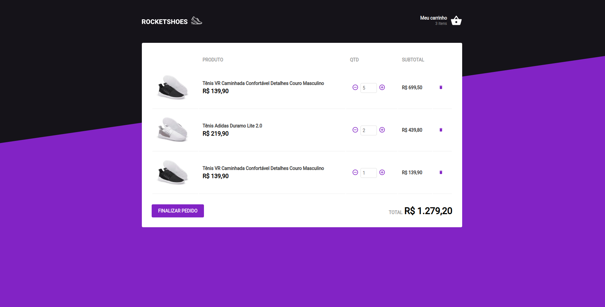

<h1 align="center">
    
</h1>

<h3 align="center">
   ...Arquitetura Flux | E-Commerce...
</h3>

<blockquote align="center">“Não espere resultados brilhantes se suas metas não forem claras”!</blockquote>

### Resultado:
<h1 align="center">
  
</h1>

<h1 align="center">
  
</h1>

# Indice
- [React](#-React)
- [Tecnologias utilizadas](#-Tecnologias-utilizadas)
- [Como baixar o projeto](#-Como-baixar-o-projeto)

## React

Nesse **desafio**, foi criado uma aplicação para mostrar como funciona o conceito do redux e praticando mais sobre o **Hooks**.

É uma aplicação que se conectar com uma **API FAKER**, para conseguir buscar algumas informações do produto e do estoque.

---

## Tecnologias utilizadas

O projeto foi desenvolvido utilizando as seguintes tecnologias

- ReactJS
- redux
- react-redux
- redux-saga
- Axios
- Styled-Components
- History
- Yup
- ESLint
- Prettier
- EditorConfig
- Reactotron
- Toastify

---
## Como baixar o projeto


```bash

  # Clonar o repositório
  $ git clone https://github.com/DevTeles/RocketShoes.git

  # Entrar no diretório
  $ cd RocketShoes

  # Instalar as dependências
  $ yarn

  # Rodar a api faker na porta 3333
  json-server server.json -p 3333

  # Iniciar o projeto
  $ yarn start
```

<br /><br />
Desenvolvido por **Rafael Teles Vital**
